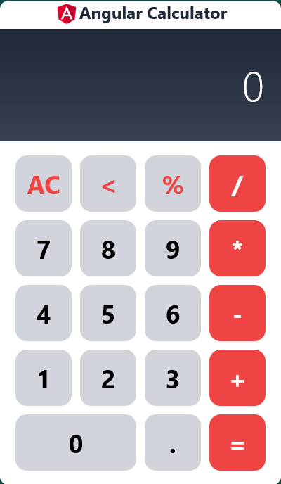
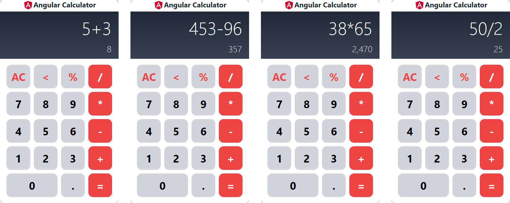

# Angular Calculator

Just a simple calculator app made with Angular 15 and Tailwind CSS

Try it → https://melyespinofl96.github.io/Angular-Calculator/

## Start

## Basic Arithmetic
Supports all 4 basic arithmetic addition subtraction multiplication and division

## Immediate Solution
You will see a solution immediately as an integer is entered

